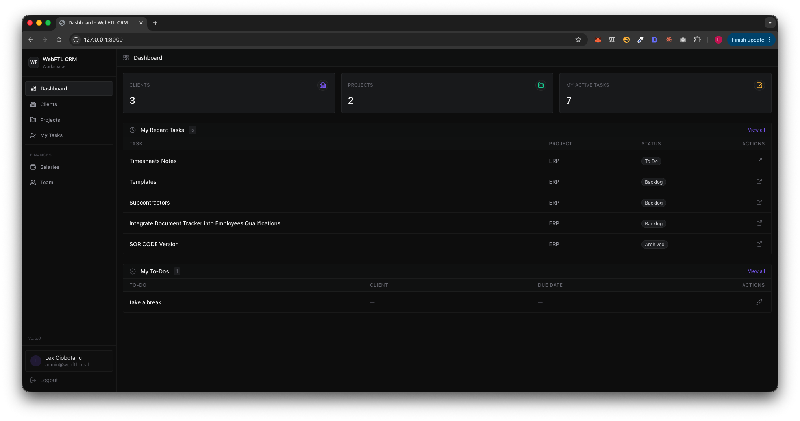
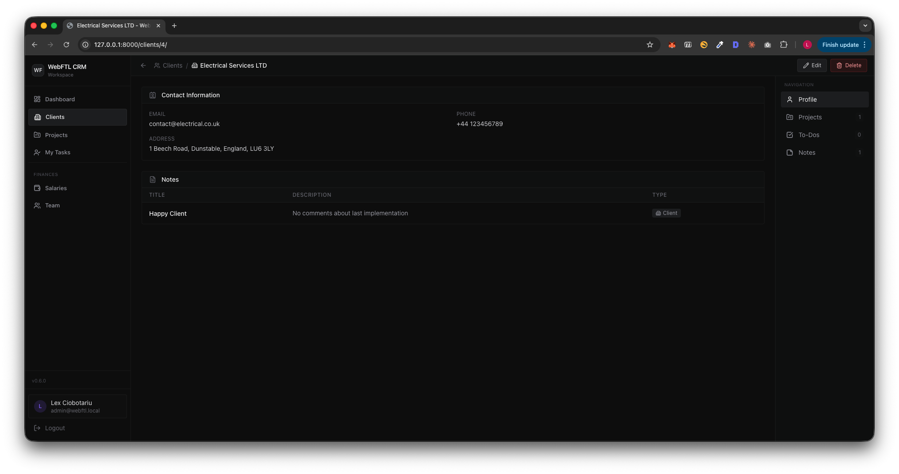
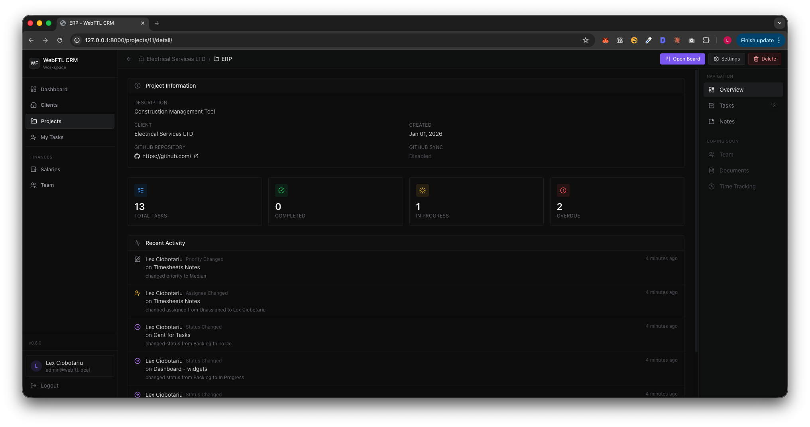
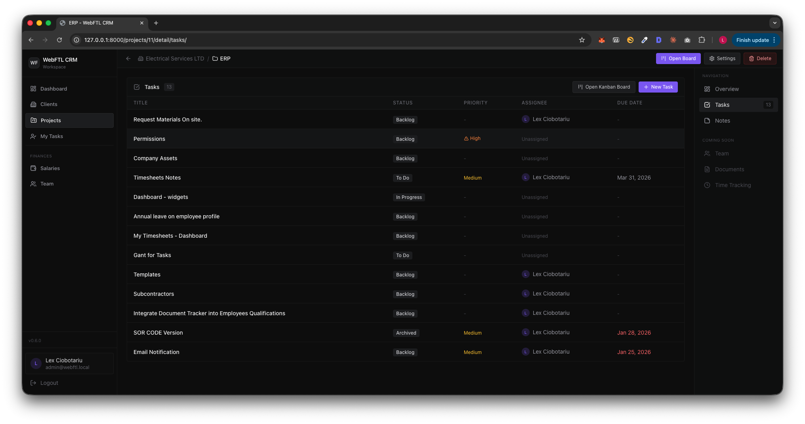
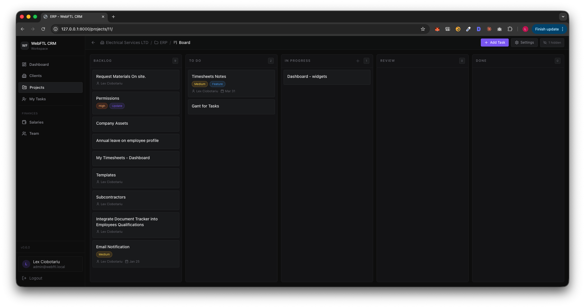
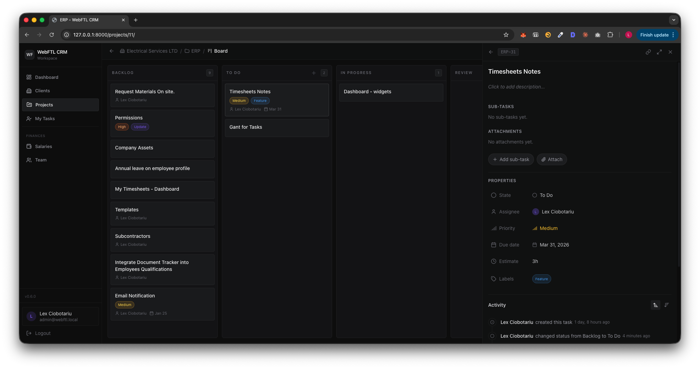
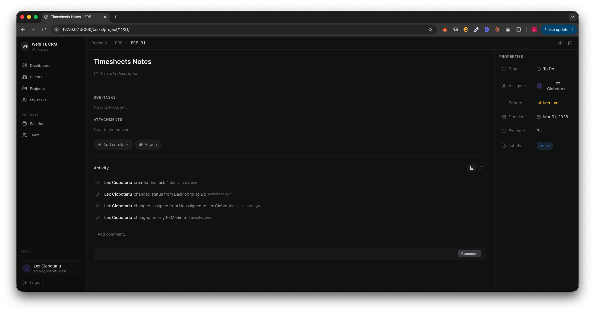

# WebFTL CRM

A personal CRM built for managing clients, projects, and tasks. I built this for my own freelancing needs — tracking who I'm working with, what's in progress, and what's next. It's lightweight, self-hosted, and gets out of your way.

You're free to use it, modify it, resell it, or do whatever you want with it. See [LICENSE](LICENSE) for details.



## Features

- **Clients** — contact info, notes, linked projects and todos
- **Projects** — overview with stats, activity log, GitHub repo sync
- **Tasks** — list and kanban board views with drag-and-drop, subtasks, comments, attachments, labels, and activity tracking
- **Todos** — personal to-do list with optional client association and due dates
- **Notes** — quick notes attached to clients
- **Salaries** — employee salary tracking with monthly breakdowns and payment records
- **Team** — user management with role-based access control (RBAC), permission presets, and user deactivation
- **Dashboard** — at-a-glance stats, recent tasks, and pending todos

## Screenshots

<details>
<summary>Client Detail</summary>


</details>

<details>
<summary>Project Overview</summary>


</details>

<details>
<summary>Task List</summary>


</details>

<details>
<summary>Kanban Board</summary>


</details>

<details>
<summary>Task Detail (Sidebar)</summary>


</details>

<details>
<summary>Task Detail (Full Page)</summary>


</details>

## Tech Stack

- **Backend:** Django 5.1, Python 3.12+
- **Frontend:** HTMX, Alpine.js, Tailwind CSS
- **Database:** PostgreSQL 16
- **Auth:** django-allauth (email-based, no username)
- **Icons:** Lucide

## Getting Started

### Prerequisites

- Python 3.12+
- Docker (for the database)

### 1. Clone the repo

```bash
git clone https://github.com/lexciobotariu/webftl_crm.git
cd webftl_crm
```

### 2. Start the database

```bash
docker compose up -d
```

This starts a PostgreSQL 16 container on port 5433.

### 3. Set up the environment

```bash
cp .env.example .env
```

Edit `.env` if needed. The defaults work out of the box for local development.

### 4. Create a virtual environment and install dependencies

```bash
python3 -m venv .venv
source .venv/bin/activate
pip install -r requirements.txt
```

### 5. Run migrations and create a superuser

```bash
python manage.py migrate
python manage.py createsuperuser
```

### 6. Start the dev server

```bash
python manage.py runserver
```

Open [http://localhost:8000](http://localhost:8000) and log in.

## Running Tests

```bash
pytest
```

## License

MIT — do whatever you want with it.
